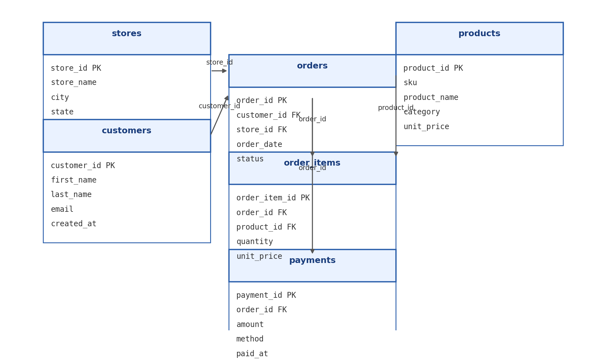

# duke-ids702-mysql-sqlproject
SQL Guidebook
# 🧠 Advanced SQL Guidebook — MySQL 8.0  
> **Duke IDS 706 · Practical Data Science**  
> Author: **Pinaki Ghosh**


---

## 📘 Overview

This repository contains a **comprehensive MySQL guidebook** demonstrating advanced SQL concepts including:
- Database design and normalization  
- Joins, aggregates, and data transformation  
- Window functions and Common Table Expressions (CTEs)  
- Set operations, JSON, and advanced clauses  
- Fully documented outputs and rubric-aligned evidence  

All work is implemented in **MySQL 8.0**, tested locally, and reproducible using the included scripts.

---

## 🗂️ Repository Structure

| File | Description |
|------|--------------|
| `mysql_setup.sql` | Schema creation & data population (DDL + DML) |
| `mysql_queries.sql` | 11 major SQL examples covering all rubric areas |
| `MySQL_queryoutput.pdf` | Real outputs from executed queries |
| `mysql_cheatsheet.md` | Quick syntax reference & tips |
| `mysql_readme.md` | Setup instructions (VS Code / Workbench / DBeaver) |
| `retail_erd_new.png` | Entity-Relationship Diagram |
| `README.md` | This project documentation |

---

## 🧱 Schema Overview

**Database:** `retail_demo`  
**Entities:**  
- `stores`, `customers`, `products`, `orders`, `order_items`, `payments`  

**Relationships:**
- `orders.customer_id → customers.customer_id`  
- `orders.store_id → stores.store_id`  
- `order_items.order_id → orders.order_id`  
- `order_items.product_id → products.product_id`  
- `payments.order_id → orders.order_id`

### ERD


---

## ⚙️ How to Run Locally

1. Open **MySQL Workbench**, **DBeaver**, or **VS Code SQLTools**.  
2. Run:
   ```sql
   SOURCE mysql_setup.sql;
   SOURCE mysql_queries.sql;
3. Verify results using MySQL_queryoutput.pdf.

4. Explore code patterns via mysql_cheatsheet.md.

| Rubric Criterion                                                          | Evidence                                       |
| ------------------------------------------------------------------------- | ---------------------------------------------- |
| **DDL** – `CREATE`, `PRIMARY KEY`, `FOREIGN KEY`, `CHECK`                 | `mysql_setup.sql`                              |
| **DML** – `INSERT`, `UPDATE`                                              | `mysql_setup.sql`                              |
| **Basics** – `SELECT`, `WHERE`, `ORDER BY`, `GROUP BY`, `HAVING`, `LIMIT` | `mysql_queries.sql` (Q1–Q2)                    |
| **Aggregates** – `SUM`, `AVG`, `COUNT`, `MAX`                             | Q2                                             |
| **Joins** – `INNER`, `LEFT`, `RIGHT`, `FULL (Union)`                      | Q3–Q5                                          |
| **Data Cleaning / Transformation** – `CASE`, `COALESCE`, `REGEXP`         | Q6 & Q10                                       |
| **Window Functions** – `ROW_NUMBER`, `DENSE_RANK`, `LAG/LEAD`             | Q7–Q9                                          |
| **CTEs** – Recursive & Non-Recursive                                      | Q10                                            |
| **Set Operations** – `UNION`, `EXCEPT`                                    | Q11                                            |
| **Advanced Features** – `JSON`, `ENUM`, `CHECK`                           | `mysql_setup.sql` (products table)             |
| **Indexes & Performance**                                                 | `CREATE INDEX` statements in `mysql_setup.sql` |
| **Documentation & Outputs**                                               | `README.md`, `MySQL_queryoutput.pdf`, ERD      |

💡 Key Highlights

✅ Fully normalized (3NF) schema

✅ Realistic but simple e-commerce retail data model

✅ Demonstrates both business logic and data engineering concepts

✅ Compatible with MySQL Workbench, VS Code, and DBeaver

✅ Includes reproducible output verification

## 🧮 Example Snippet

Here’s an example query from the project demonstrating **aggregates**, **JOIN**, and **HAVING**:

```sql
-- Example: Category-wise revenue with GROUP BY and HAVING
SELECT 
    p.category,
    SUM(oi.quantity) AS total_units,
    ROUND(SUM(oi.quantity * oi.unit_price), 2) AS gross_revenue
FROM order_items oi
JOIN products p ON p.product_id = oi.product_id
GROUP BY p.category
HAVING total_units > 0
ORDER BY gross_revenue DESC;


📚 Course & Author

Course: IDS 706 – Practical Data Science
Program: Duke University MIDS Program
Author: Pinaki Ghosh
Semester: Fall 2025
